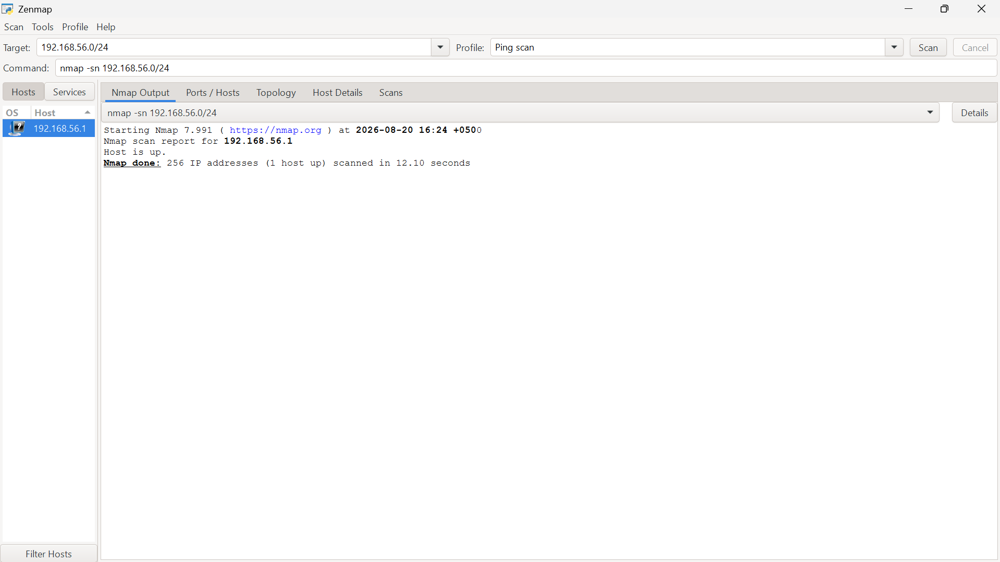
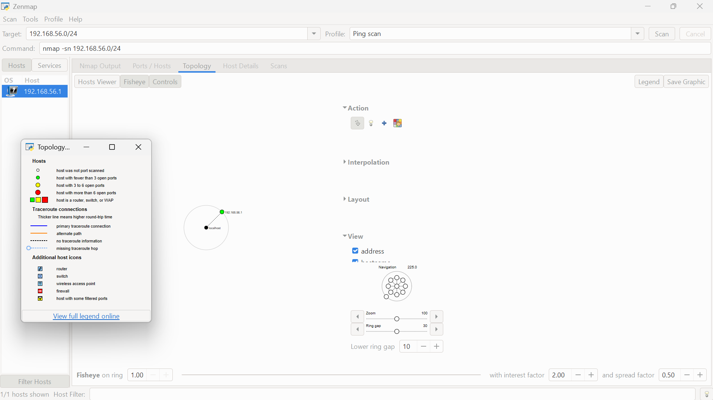

# 🌐 Network Scanning & Host Discovery with Zenmap (W2-PM5)

---

## 📌 Executive Summary
Network scanning ethical hacking aur penetration testing ka Phase 2 hai. Is practical module mein Zenmap (official Nmap GUI) ka istemal karte hue local area network (LAN) subnet ki discovery, active host identification, aur network topology mapping perform ki gayi hai.

Is exercise ka maqsad active devices ko identify karna, unke IP/MAC parameters ko map karna, aur unauthorized ya rogue assets ko visually track karna tha.

---

## ⚙️ Target & Environment Scope
* **Pentester / Author:** Faheem Ali Wattoo
* **Program:** Networkwalks Cybersecurity & Ethical Hacking Internship
* **Batch Code:** B082-Networkwalks
* **Target Network Subnet:** `192.168.56.0/24` (VirtualBox Host-Only Network Adapter)
* **Scanner Platform:** Windows PC (Zenmap GUI v7.991)

---

## 🧰 Tools & Commands Matrix

| Tool / Utility | Role | Command Executed |
| :--- | :--- | :--- |
| **Windows CMD** | Local IP & Subnet Discovery | `ipconfig` |
| **Zenmap (GUI)** | Ping Scan / Host Discovery | `nmap -sn 192.168.56.0/24` |
| **Zenmap Topology** | Visual Node Mapping | Radial Net Graph Export |

---

## 🔬 Hands-on Technical Activities & Verification

### 🔹 Task 1 & 2: Local Subnet Identification
Windows Command Prompt mein `ipconfig` command chala kar local host-only interface ka IP address aur subnet mask verify kiya gaya:
* **Local Subnet:** `192.168.56.0/24`
* **Default Gateway / Host:** `192.168.56.1`

---

### 🔹 Task 3 & 4: Ping Scan & Live Host Count
Zenmap mein target subnet `192.168.56.0/24` enter karke **Ping Scan** profile select kiya gaya.

`nmap -sn 192.168.56.0/24`

* **Scan Duration:** 256 IP addresses scanned in 12.10 seconds.
* **Total Live Hosts Discovered:** 1 active host (`192.168.56.1`).

#### Evidence - Nmap Output Scan:

---

### 🔹 Task 5 & 6: IP & MAC Address Identification
* **Live Host IP:** `192.168.56.1`
* **MAC Address Observation:** Nmap scanning machine ke apne local network interface ka MAC address remote packet ki tarah display nahi karta (yeh direct `ipconfig /all` se verify hota hai).

---

### 🔹 Task 7: Network Topology Generation & Export
Zenmap ke **Topology** tab ko open karke Legend enable kiya gaya aur interactive network node graph inspect kiya gaya. Graphic ko high-resolution PDF/image format mein export kiya gaya.

#### Evidence - Zenmap Topology Interface & Export:

#### Rendered Network Topology Graphic:
![Network Topology Map][1st_sacn.pdf](https://github.com/user-attachments/files/31264812/1st_sacn.pdf)

---

## 📊 Risk Analysis & Security Impact

| # | Finding | Observation / Proof | Potential Security Risk | Risk Level |
| :---: | :--- | :--- | :--- | :---: |
| **01** | Subnet Responsiveness | Active response received on `192.168.56.1` | Enables attackers to identify live target addresses on the segment | `Low` |
| **02** | Unsegmented Local Adapters | Discovery probes map internal interface | Internal discovery facilitates lateral reconnaissance | `Low` |

---

## 🛡️ Defensive Recommendations & Hardening

* **Firewall ICMP Filtering:** Local endpoints par ICMP echo requests (ping probes) ko block karein agar internal asset discovery restrict karni ho.
* **Network Segmentation & VLANs:** Virtual machines aur host adapters ko separate VLANs / isolated private networks mein rakhein.
* **Periodic Network Discovery:** Administrators ko apne subnets par periodic Nmap scans chalane chahiyein taake unauthorized rogue devices detect ho sakein.

---

## 👨‍💻 Author / Pentester Details
* **Pentester Name:** Faheem Ali Wattoo
* **Program:** Networkwalks Cybersecurity & Ethical Hacking Internship
* **Batch:** B082 Networkwalks
* **Lead Instructor:** [Waqas Karim CCIE](https://www.linkedin.com/in/waqaskarim/)
